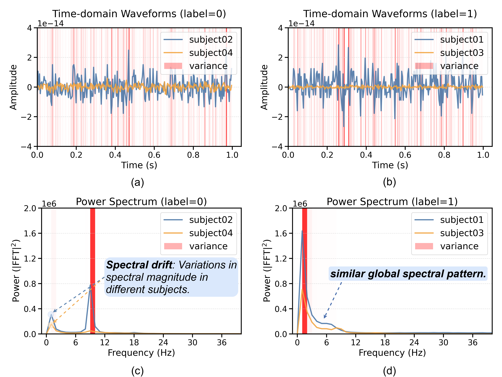
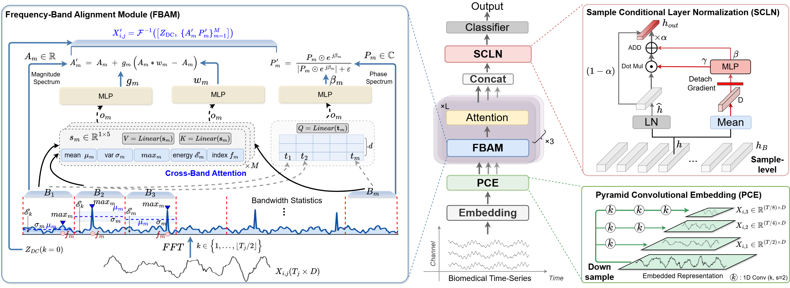

 # BioFormer: Rethinking Cross-Subject Generalization via Spectral Structural Alignment in Biomedical Time-Series

📄 Paper: [Preprint](https://arxiv.org/pdf/2605.22468)

---

## 🔍 Idea

BioFormer models **spectral drift** across subjects and aligns frequency structures instead of raw signals.

<p align="center">
  
</p>

---

## 🏗️ Model

<p align="center">
  
</p>

---

## 🔗 Relation to Official Repository

This repository is a **personal version** of the BioFormer project for easier usage and experimentation.

For the **official implementation and updates maintained by our research group**, please refer to:

👉 https://github.com/NKU-EmbeddedSystem/BioFormer

The official repository provides:
- More complete documentation and updates
- Standardized experimental pipelines
- Long-term maintenance and support

This personal repo mainly focuses on:
- Lightweight reproduction
- Quick experimentation
- Individual development and extensions

## 📖 Citation

```bibtex
@inproceedings{bioformer2026,
  title={BioFormer: Rethinking Cross-Subject Generalization via Spectral Structural Alignment in Biomedical Time-Series},
  author={Du, Guikang and Li, Haoran and Liu, Xinyu and Zhang, Zhibo and Gong, Xiaoli and Zhang, Jin},
  booktitle={Forty-third International Conference on Machine Learning},
  year={2026}
}
```

⭐ Star if helpful!
